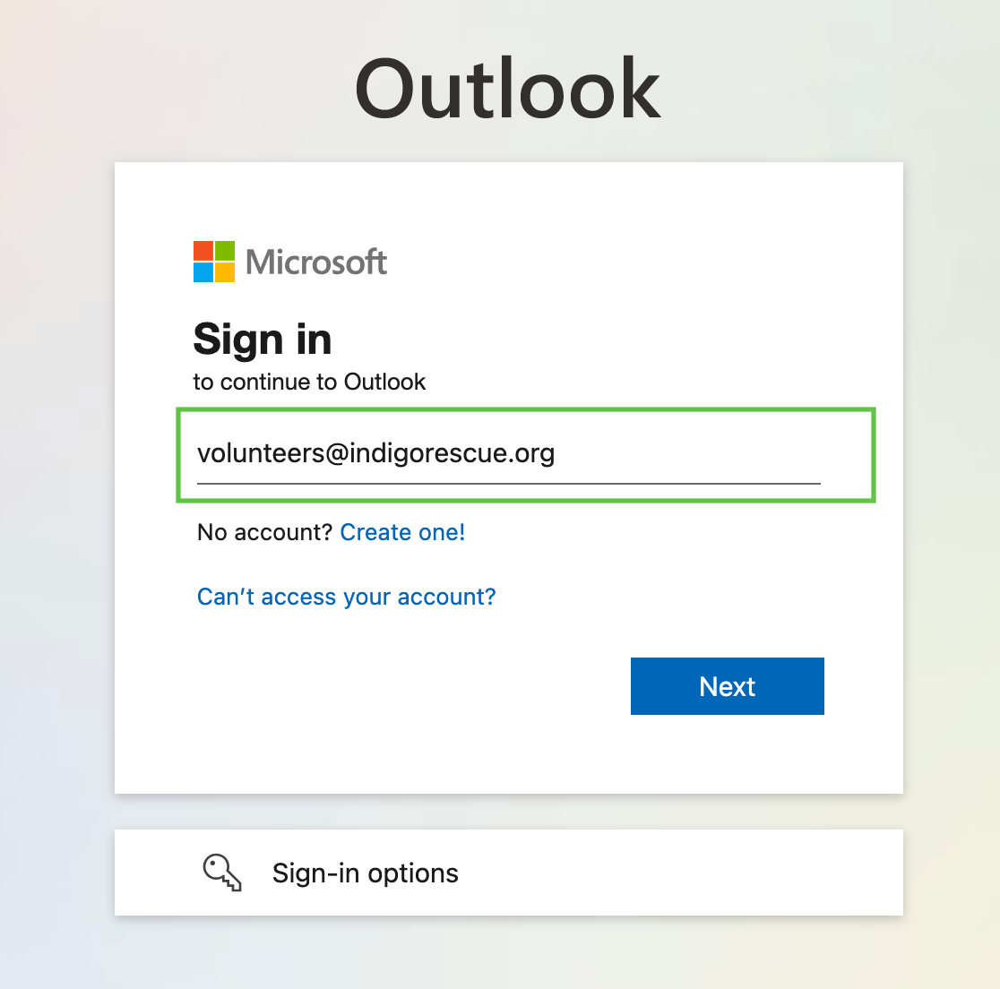

# How to Log into Outlook

1. Go to [https://outlook.office365.com](https://outlook.office365.com)
2. When prompted for a username:
   - To access the **volunteers** email, enter `volunteers@indigorescue.org` and click **Next**
   - To access the **fosters** email, enter `fosters@indigorescue.org` and click **Next**

3. Enter the password and click **Sign In**
   - To get the password, please contact **Benjamin Metzler**
   - Once you receive it, be sure to store it securely for future use

4. You will now be logged into the Outlook email interface.
